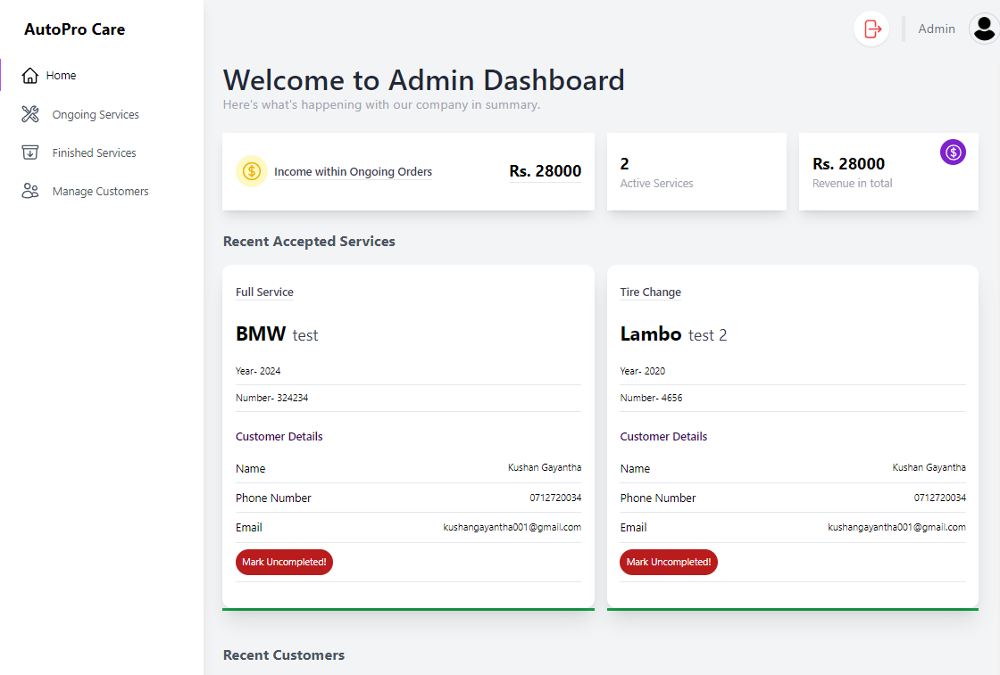
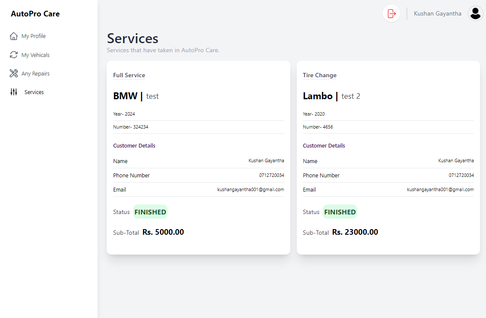

# Car Rental and Service Center Web Application

This is a full-stack web application built using React for the frontend and Express for the backend. The application allows users to rent cars and schedule service appointments at the service center.

## Features

- User authentication: Users can sign up, log in, and log out securely.
- Car rental: Users can browse available cars, view details, and rent cars.
- Service scheduling: Users can schedule service appointments for their cars.
- Admin panel: Admins can manage cars, services, and user accounts.

## Prerequisites

- Node.js
- npm (Node Package Manager)
- MySQL

## Getting Started

1. Clone the repository:

```bash
git clone https://github.com/Kushan2k/react-car-rental-service-with-express-api.git
```

2. navigate in to the 'backend' folder

```bash
cd backend && npm i && npx prisma generate && npx prisma db push

```

3. add the environment variables in .env file

```env
  JWT_SECRET=" "
  ADMIN_KEY=" "
  DATABASE_URL=" "
```

4. start the backend sserver

```bash
npm run dev

```

5. navigate to the front end

```bash
npm i && npm start
```

## Screenshots

Here are some screenshots of the application:


_Hero Section_


_User Login_


_User Regsiter_


_Admin login_


_add service_


_admin dashboard_


_finished services_


_finished services_

<hr/>
